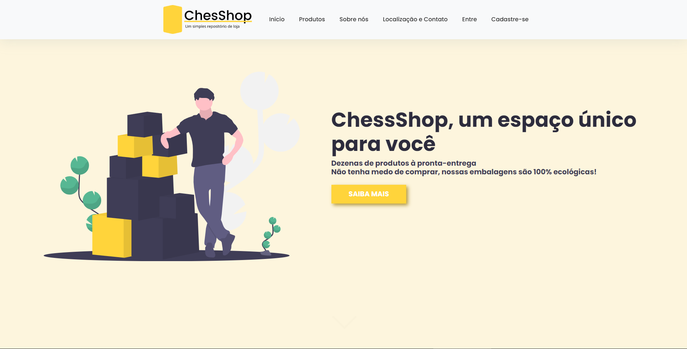
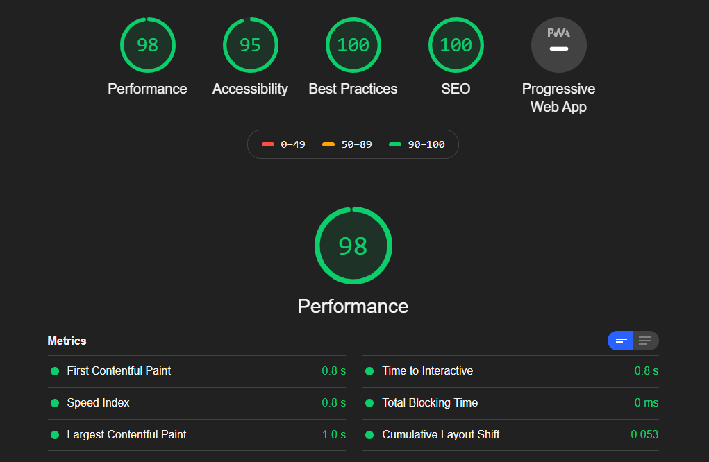

# Chess Shop Website

<a href="https://github.com/RonaldoMurakamiK/chess-shop-website/blob/master/LICENSE">
     
</a><br><br>

## Screenshot

### Desktop


### Mobile


## Demo
<br><br>

## Lighthouse
<br><br>

## Getting Started
```sh
$ git clone

And just execute the "index.html" or run it locally.
```

## License
This repository is released under the [MIT](https://github.com/RonaldoMurakamiK/chess-shop-website/blob/master/LICENSE) license.
